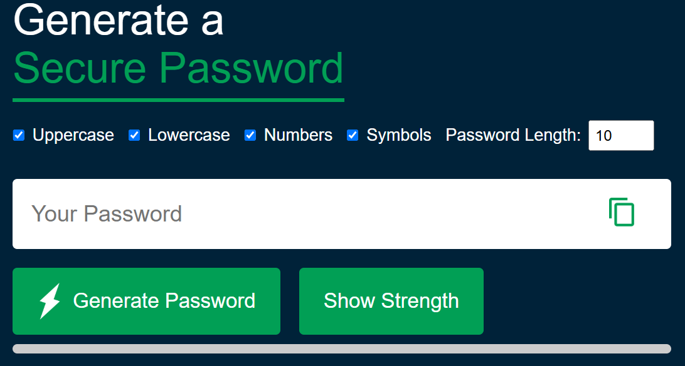

# 🔐 Random Password Generator

A simple and customizable password generator web application that helps users create strong, secure, and random passwords in one click. Built with **HTML**, **CSS**, and **JavaScript**.

## 🌟 Features

- ✅ Generate strong, secure random passwords
- ✅ Customizable character options:
  - Uppercase letters
  - Lowercase letters
  - Numbers
  - Symbols
- ✅ Adjustable password length (4–50 characters)
- ✅ One-click copy to clipboard
- ✅ Real-time feedback messages
- ✅ Responsive and clean user interface

## 🚀 Live Demo

👉 [Click here to try it out](https://random-password-generator-gold-seven.vercel.app/)  

## 📸 Screenshots

  

## 🛠️ Technologies Used

- HTML5
- CSS3
- JavaScript (ES6)


## 🧪 How to Use

1. Clone or download this repository:
   ```bash
   git clone https://github.com/yourusername/password-generator.git
   ```
2. Open `index.html` in your web browser.
3. Select desired options, choose a length, and click **"Generate Password"**.
4. Click **"Copy"** to save it to your clipboard.

## ✅ To-Do (Future Enhancements)

- [ ] Add a password strength meter
- [ ] Option to exclude similar characters (e.g. `O` vs `0`, `l` vs `1`)
- [ ] Toggle dark/light mode
- [ ] Save or export password list
- [ ] Add animation or toast notifications

## 📄 License

This project is open-source and available under the [MIT License](LICENSE).

## 🙌 Author
Made with 💙 by Zia UL Mustafa  

## 🙏 Credits

This project was inspired by a tutorial on YouTube by [GreatStack](https://www.youtube.com/watch?v=Xrsb9SiF3a8).  
Big thanks for the helpful guide!

